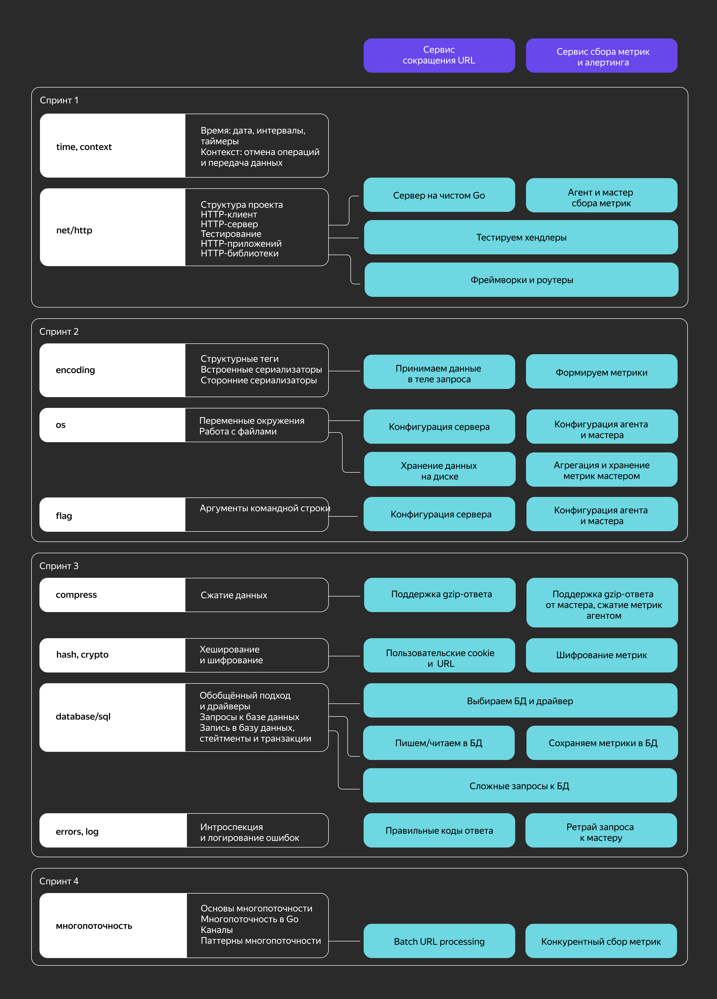
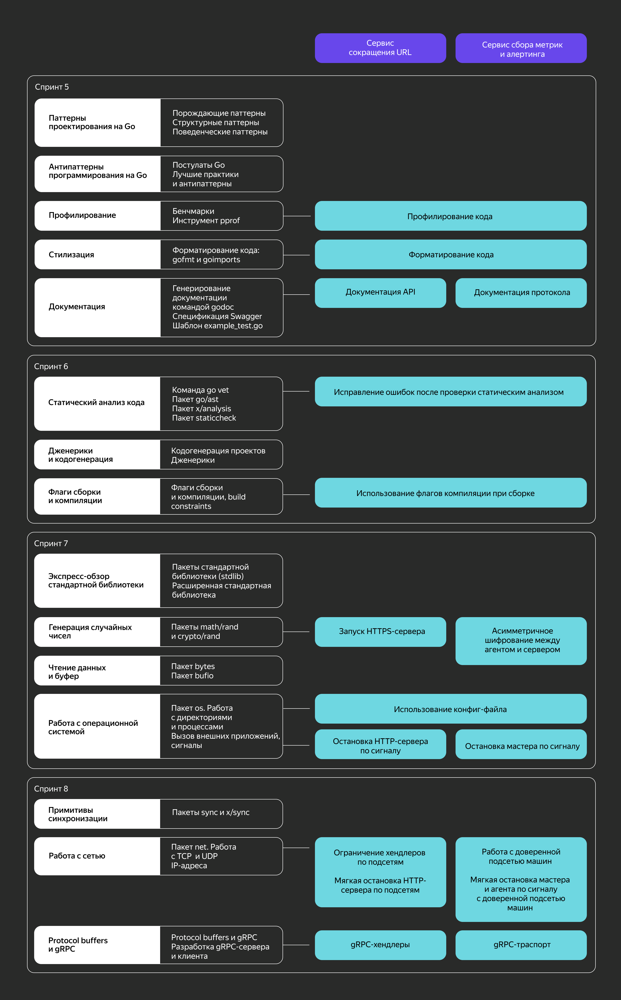

# Advanced Golang Developer

This repository is the result of my work on the Yandex Practicum course "Advanced golang developer without deadlines".

## Description:

This project implements an agent and server system for managing metrics using the Go programming language. The agent collects metrics from the `runtime` package and securely transmits them to the server for storage and retrieval.

## Key Features:

- **Configuration:** Supports flexible configuration via command-line flags, environment variables, and JSON files for customization.
- **Communication:** Employs HTTP or gRPC for network communication between agent and server, ensuring interoperability and efficiency.
- **Data Compression and Encryption:** Leverages gzip compression for reducing data size and RSA encryption for protecting sensitive information in transit.
- **Checksum Validation:** Guarantees data integrity by calculating and verifying checksum hashes on the agent side, with the server returning Bad Request errors for mismatches.
- **Storage Options:** Offers both in-memory and Postgresql storage options for metric data, providing flexibility and scalability.
- **File Persistence:** Enables automatic saving of in-memory data to disk for improved fault tolerance and data recovery.
- **Graceful Shutdown:** Ensures clean termination of agent and server processes, preventing data loss and unexpected resource leaks.
- **Logging:** Implements informative logging mechanisms for tracing agent and server activities, aiding in debugging and analysis.
- **Versioning and Information:** Displays version, build date, and commit hash for clarity and reproducibility.
- **Trusted IP Address Filtering:** Optionally restricts metric acceptance to authorized IP addresses, enhancing security.
- **Multithreading:** Utilizes multithreading for improved performance and concurrent processing of tasks.
- **Error Handling:** Handles potential errors robustly, providing meaningful error messages and graceful recovery mechanisms.

## Non-Functional Requirements:

- **Build-Time Metadata:** Sets version, build date, and commit hash at the linking stage for transparency and tracking.
- **Documentation:** Includes comprehensive documentation in the form of comments for better code understanding and maintainability.
- **Test Coverage:** Aims for 80% test coverage to ensure code quality and reliability.
- **Benchmarks:** Provides benchmarks to measure performance characteristics and identify potential optimization opportunities.
- **Code Formatting:** Adheres to established Go formatting standards for consistency and readability.

## Additional Component:

- **AST Static Analyzer:** An optional analyzer tool prohibits direct calls to `os.Exit` in the `main` function, enforcing recommended practices for controlled program termination.

**Performance Analysis and Optimization:**
During the development, a performance analysis was performed using the 'pprof` tool.

## Topics for each sprint:

